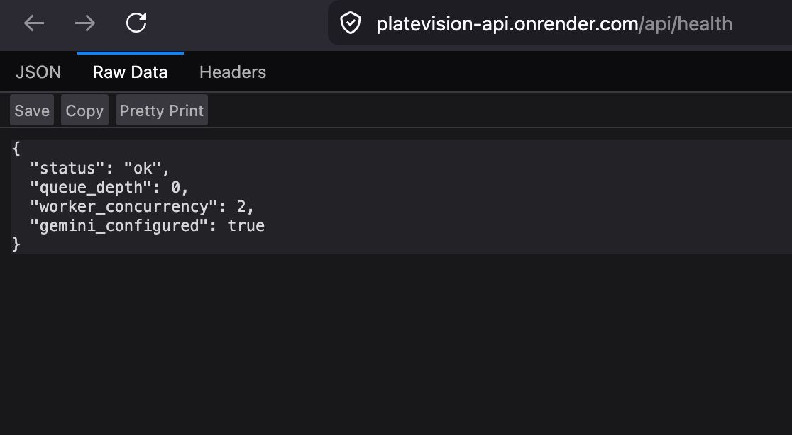
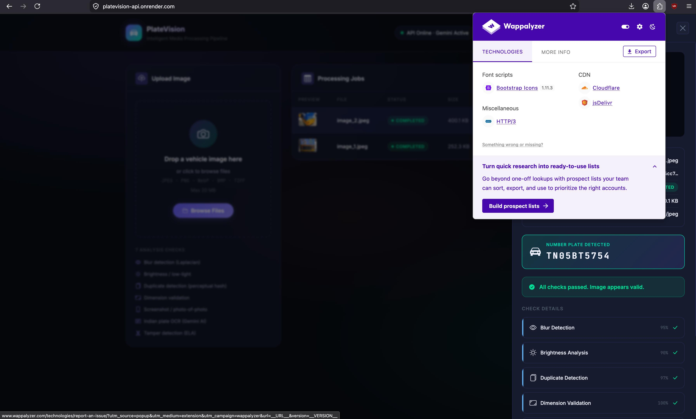
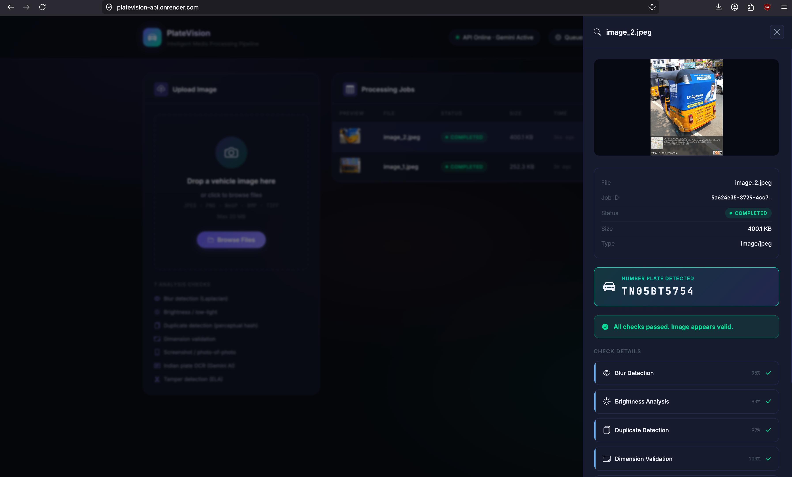
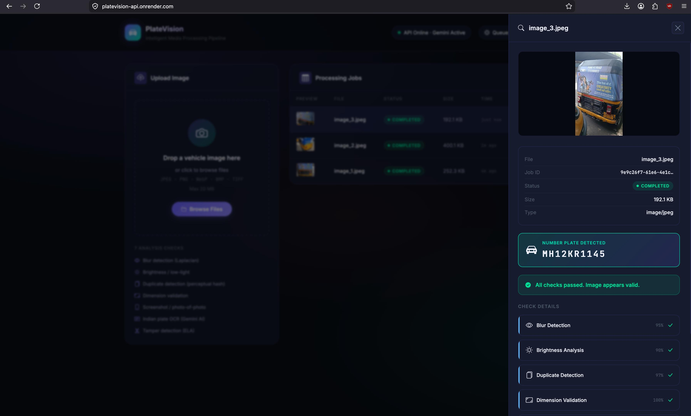

# PlateVision — Intelligent Vehicle Image Analysis System

> A production-ready, fully Dockerised vehicle image processing pipeline with AI-powered number plate OCR, 7-layer image quality checks, a real-time glassmorphism dashboard, and a full Grafana observability stack.

---

## Table of Contents

- [What Does It Do?](#what-does-it-do)
- [Full Architecture](#full-architecture)
- [Technology Stack — Definitions & Rationale](#technology-stack--definitions--rationale)
- [How Each Component Works](#how-each-component-works)
  - [1. Nginx — Reverse Proxy & Static Server](#1-nginx--reverse-proxy--static-server)
  - [2. FastAPI Backend](#2-fastapi-backend)
  - [3. Async Queue Worker](#3-async-queue-worker)
  - [4. Image Analyzer — 7 Checks](#4-image-analyzer--7-checks)
  - [5. SQLite Database](#5-sqlite-database)
  - [6. Frontend Dashboard](#6-frontend-dashboard)
  - [7. Observability Stack (Prometheus + Grafana)](#7-observability-stack-prometheus--grafana)
- [Quick Start — Docker](#quick-start--docker)
- [Windows Setup](#windows-setup)
- [Development Mode (no Docker)](#development-mode-no-docker)
- [Environment Variables](#environment-variables)
- [API Reference](#api-reference)
- [Grafana Dashboard](#grafana-dashboard)
- [Project Structure](#project-structure)
- [Performance Tuning](#performance-tuning)
- [Gemini API Quota Guide](#gemini-api-quota-guide)
- [Troubleshooting](#troubleshooting)
- [Live Output](#live-output)

---

## What Does It Do?

PlateVision is an **end-to-end vehicle image intelligence pipeline**. A user uploads a vehicle photo through a web dashboard. The system:

1. **Accepts** the image via an async REST API and returns a `job_id` immediately (non-blocking).
2. **Queues** the job for background analysis — the upload response is instant.
3. **Runs 7 image quality checks** in sequence: blur, brightness, duplicates, resolution, screenshot detection, number plate OCR, and tamper detection.
4. **Extracts the number plate text** using Google Gemini Vision AI (multi-model fallback chain).
5. **Stores results** in SQLite and streams them back to the browser via polling.
6. **Monitors** the entire system in real-time via Grafana dashboards — CPU, memory, HTTP metrics.

**Use cases:** fleet management verification, vehicle registration validation, logistics imaging QA, insurance claim photo review.

---

## Full Architecture

```
 ┌─────────────────────────────────────────────────────────────────┐
 │                        USER BROWSER                             │
 │          http://localhost:4209   (App)                          │
 │          http://localhost:3000   (Grafana)                      │
 └───────────┬────────────────────────────────┬───────────────────┘
             │ HTTP :4209                      │ HTTP :3000
             ▼                                 ▼
 ┌─────────────────────┐            ┌─────────────────────┐
 │  Nginx (nginx:1.27) │            │  Grafana            │
 │  ─────────────────  │            │  ─────────────────  │
 │  • Serves static    │            │  • Pre-built CPU /  │
 │    HTML/CSS/JS      │            │    memory dashboard │
 │  • Gzip + cache     │            │  • Auto-provisioned │
 │  • Rate limiting    │            │    Prometheus DS    │
 │  • /api/* → proxy  │            └────────┬────────────┘
 └──────────┬──────────┘                     │
            │ :8000 (internal Docker network) │
            ▼                                 ▼
 ┌─────────────────────┐            ┌─────────────────────┐
 │  FastAPI (Python)   │◄──scrape── │  Prometheus         │
 │  ─────────────────  │  /metrics  │  ─────────────────  │
 │  POST /api/upload   │            │  • Scrapes: API +   │
 │  GET  /api/status   │            │    cAdvisor +       │
 │  GET  /api/results  │            │    Node Exporter    │
 │  GET  /api/jobs     │            │  • 7-day TSDB       │
 │  GET  /metrics      │            └────────┬────────────┘
 └──────────┬──────────┘                     │
            │ asyncio.Queue                  ▼
            ▼                      ┌─────────────────────┐
 ┌─────────────────────┐            │  cAdvisor           │
 │  Background Worker  │            │  • Docker container │
 │  ─────────────────  │            │    CPU/mem stats    │
 │  pending →          │            └─────────────────────┘
 │  processing →       │
 │  completed/failed   │            ┌─────────────────────┐
 └──────────┬──────────┘            │  Node Exporter      │
            │ analyze_image()        │  • Host OS CPU/disk │
            ▼                       └─────────────────────┘
 ┌─────────────────────┐
 │  Image Analyzer     │
 │  ─────────────────  │
 │  1. Blur (OpenCV)   │
 │  2. Brightness      │
 │  3. Duplicate Hash  │
 │  4. Dimensions      │
 │  5. Screenshot      │
 │  6. Plate OCR       │◄── Google Gemini Vision API
 │  7. Tamper ELA      │
 └──────────┬──────────┘
            │ SQL (WAL mode)
            ▼
 ┌─────────────────────┐
 │  SQLite (jobs.db)   │
 │  jobs + img_hashes  │
 │  WAL + 32MB cache   │
 └─────────────────────┘
```

---

## Technology Stack — Definitions & Rationale

### 🐍 Python 3.11
**What:** The programming language for the backend.  
**Why:** Python 3.11 brought a 10–60% performance improvement over 3.10. The ML/CV ecosystem (OpenCV, Pillow, NumPy) is Python-first. `asyncio` enables non-blocking I/O for handling many concurrent requests without threads.

---

### ⚡ FastAPI
**What:** A modern Python web framework for building REST APIs.  
**Why:** FastAPI uses Python type hints to automatically generate OpenAPI docs, validate request/response schemas via Pydantic, and handle async I/O. It is benchmarked as one of the fastest Python frameworks (on par with Node.js). We use it because the upload endpoint must be non-blocking — the image is saved and queued in milliseconds while analysis happens in the background.

**How we implemented it:**
- `POST /api/upload` — accepts multipart form data, saves file, creates DB record, enqueues job, returns `202 Accepted` immediately
- `GET /api/status/{id}` — lightweight poll endpoint (no results payload)
- `GET /api/results/{id}` — full results with all 7 check outputs
- `GET /metrics` — Prometheus metrics endpoint (via instrumentator)
- `lifespan` context manager — handles DB init, worker startup/shutdown cleanly

---

### 🔄 asyncio Queue Worker (`queue_worker.py`)
**What:** A background processing system using Python's built-in `asyncio.Queue`.  
**Why:** Images take 2–5 seconds to analyse (Gemini API call + 6 CV checks). Running this synchronously in the request handler would block the server. The queue decouples upload from processing — the user gets an instant response, and processing happens concurrently.

**How it works:**
```
upload → enqueue(job_id) → Queue
                              ↓
worker coroutine (always running) → dequeue → analyze_image() → DB update
```
- `WORKER_CONCURRENCY` env var controls how many workers run in parallel
- Workers update the job status to `processing`, then `completed` or `failed`
- If the analyzer crashes, the error is stored in the DB and the job is marked `failed`

---

### 🗄️ SQLite + aiosqlite
**What:** A file-based relational database. `aiosqlite` wraps it with async/await support.  
**Why:** SQLite is zero-config, serverless, and sufficient for this workload (up to ~10k concurrent reads, sequential writes). No separate database container needed. `aiosqlite` allows non-blocking DB operations inside FastAPI's async event loop.

**How we configured it for performance:**
| SQLite Pragma | Value | Why |
|---|---|---|
| `journal_mode` | `WAL` | Write-Ahead Logging: readers never block writers |
| `synchronous` | `NORMAL` | Safe with WAL; ~2× faster than FULL |
| `cache_size` | `-32000` (32 MB) | Hot pages stay in RAM |
| `mmap_size` | `134217728` (128 MB) | Memory-mapped I/O for reads |
| `busy_timeout` | `5000` ms | Wait before "database is locked" error |

**Schema:**
- `jobs` table — stores every upload: status, filename, file_path, plate_text, results JSON, timestamps
- `image_hashes` table — stores perceptual hash per job for duplicate detection

---

### 🌐 Nginx
**What:** A high-performance HTTP server and reverse proxy.  
**Why:** The FastAPI container must not be exposed directly to the internet. Nginx sits in front and handles:
1. **Static file serving** — HTML/CSS/JS at zero Python overhead
2. **Reverse proxy** — forwards `/api/*` to the FastAPI container
3. **Gzip compression** — reduces transferred bytes by 60–80% for JSON/JS/CSS
4. **Rate limiting** — `/api/upload` is limited to 10 uploads/min per IP (prevents abuse)
5. **Security headers** — `X-Frame-Options`, `X-XSS-Protection`, `X-Content-Type-Options`
6. **Upload size enforcement** — `client_max_body_size 25M`

**Port mapping:** `0.0.0.0:4209 → nginx:80 → api:8000` (only port 4209 is exposed to the host)

---

### 🤖 Google Gemini Vision API
**What:** A multimodal large language model that can analyse images and return structured text.  
**Why:** Classical OCR (Tesseract, EasyOCR) struggles with real-world vehicle plates — varied angles, lighting, fonts, occlusion. Gemini's vision understanding handles these cases robustly and returns structured JSON output directly.

**How we implemented it:**
```python
prompt = "...Only report a plate if you can clearly read it. Do NOT guess..."
response = model.generate_content(
    [prompt, image],
    generation_config={"response_mime_type": "application/json"}
)
```
- `response_mime_type: "application/json"` forces Gemini to return valid JSON — no regex parsing needed
- The prompt explicitly forbids hallucination ("Do NOT guess or invent text")
- Multi-model fallback chain: `gemini-flash-latest → gemini-3.5-flash → gemini-2.0-flash → gemini-2.0-flash-lite`
- If ALL models fail (quota exceeded), returns `plate_found: false` — **never returns fake data**

---

### 🖼️ OpenCV (`opencv-python-headless`)
**What:** A computer vision library for image processing.  
**Why:** OpenCV is the industry standard for real-time image analysis. The `-headless` variant excludes GUI dependencies (no screen needed inside Docker).

**Used for:**
- **Blur detection:** `cv2.Laplacian(gray, cv2.CV_64F).var()` — Laplacian variance measures edge sharpness
- **Brightness analysis:** Convert to HSV, measure mean V-channel
- **Screenshot detection:** `cv2.Canny()` edge detection in top/bottom bands to detect UI chrome

---

### 🖼️ Pillow (PIL)
**What:** Python Imaging Library — reads and manipulates images.  
**Why:** Superior EXIF data reading vs OpenCV. Also used for the ELA tamper detection which requires JPEG re-compression at a controlled quality level.

**Used for:**
- Reading EXIF tags (Make, FocalLength, Software) for screenshot detection
- Re-saving images at JPEG quality=90 for Error Level Analysis
- Generating image thumbnails for Gemini Vision API input

---

### 🔏 imagehash
**What:** Perceptual image hashing library.  
**Why:** A regular MD5 hash changes completely if you resize or re-encode the image. Perceptual hash (`pHash`) produces similar hashes for visually similar images — detecting near-duplicates even if re-compressed or slightly cropped.

**How it works:** The image is DCT-transformed, and a 64-bit hash is generated from the relative values of frequency components. Two images with Hamming distance < 10 are considered duplicates.

---

### 📦 Pydantic + pydantic-settings
**What:** Python data validation and settings management libraries.  
**Why:** Pydantic v2 validates incoming API requests and outgoing responses at compile-time speed (Rust core). `pydantic-settings` reads environment variables and `.env` files into typed Python classes — no manual `os.getenv()` calls.

**Example:**
```python
class Settings(BaseSettings):
    gemini_api_key: str = ""
    max_file_size_mb: int = 20
    model_config = {"env_file": [".env", "../.env"]}
```
Any mismatch (wrong type, missing required field) raises a clear error at startup.

---

### 🐳 Docker + Docker Compose
**What:** Docker packages each service into an isolated container. Docker Compose defines the multi-container application.  
**Why:** Eliminates "works on my machine" problems. The entire stack — Python 3.11, OpenCV, Nginx, Prometheus, Grafana — runs identically on Mac, Windows (WSL2), and Linux.

**How we structured it:**
- **`api` service** — builds from `./backend/Dockerfile`, pip installs all dependencies into a slim Python image
- **Named volumes** (`uploads_vol`, `db_vol`) — data persists across `docker compose restart`
- **`internal` network** — `api` and `nginx` share this; `api` is never directly exposed
- **`monitoring` network** — Prometheus, Grafana, cAdvisor, Node Exporter, and `api` share this
- **Resource limits** — `cpus: "0.50"`, `memory: 512M` prevent one container starving the host
- **Health checks** — `docker compose` waits for `api` to pass `/api/health` before starting `nginx`

**Dockerfile design:**
```dockerfile
FROM python:3.11-slim-bookworm   # minimal base (~150MB vs ~900MB full)
RUN pip install --timeout 300 --retries 5 -r requirements.txt
# --timeout prevents build failures on slow networks
# --retries 5 auto-retries on transient download errors
```

---

### 📊 Prometheus
**What:** An open-source time-series metrics database and scraper.  
**Why:** Prometheus uses a pull model — it periodically scrapes HTTP endpoints that expose metrics. This is more reliable than push-based systems (no data loss if the app restarts). All scraped data is stored in a local time-series database (TSDB) with 7-day retention.

**What it scrapes in this project:**
| Target | Port | Metrics |
|---|---|---|
| FastAPI (`/metrics`) | 8000 | HTTP request count, latency histograms, in-progress requests |
| cAdvisor | 8080 | Container CPU, memory, network, disk I/O per container |
| Node Exporter | 9100 | Host OS CPU modes, memory, disk, filesystem |
| Prometheus itself | 9090 | Self-monitoring (scrape durations, etc.) |

---

### 📈 prometheus-fastapi-instrumentator
**What:** A Python library that automatically instruments FastAPI routes and exposes a `/metrics` endpoint.  
**Why:** Adding 5 lines of code gives Prometheus full HTTP observability — request rates by endpoint, response latency (p50/p95/p99 histograms), error rates, and in-progress request counts.

**How implemented:**
```python
from prometheus_fastapi_instrumentator import Instrumentator
Instrumentator(
    should_group_status_codes=True,
    excluded_handlers=["/metrics"],  # don't track the metrics endpoint itself
).instrument(app).expose(app, endpoint="/metrics")
```

---

### 📦 cAdvisor (Container Advisor)
**What:** Google's open-source container resource monitoring daemon.  
**Why:** Docker itself doesn't expose per-container CPU/memory metrics in a Prometheus-compatible format. cAdvisor reads from the Docker daemon and Linux cgroup filesystem, and exposes everything at `/metrics`.

**Flags we added:**
```yaml
--docker_only=true   # skip system/host cgroups, only Docker containers
--allowlisted_container_labels=com.docker.compose.service,com.docker.compose.project
```
This makes metrics queryable by service name (e.g. `container_label_com_docker_compose_service="api"`).

---

### 🖥️ Node Exporter
**What:** Prometheus exporter for host machine hardware and OS metrics.  
**Why:** cAdvisor only covers containers. Node Exporter exposes the underlying host's CPU cores, RAM, disk usage, and network interface stats — essential for understanding whether the machine is under pressure.

---

### 📉 Grafana
**What:** An open-source analytics and visualisation platform for time-series data.  
**Why:** Prometheus stores raw metrics but has no dashboard UI beyond a basic query interface. Grafana turns raw metric queries (PromQL) into beautiful, interactive dashboards.

**How we auto-provisioned it (zero manual setup):**
```
grafana/
├── provisioning/
│   ├── datasources/prometheus.yml   ← auto-wires Prometheus on boot
│   └── dashboards/dashboards.yml    ← tells Grafana where to load dashboards
└── dashboards/
    └── cpu_dashboard.json           ← pre-built dashboard JSON
```
On first boot, Grafana reads these files and the dashboard is immediately available — no manual clicking in the UI.

**Dashboard panels:**
- Container CPU % per service (time series)
- API / Nginx CPU gauges
- Host CPU % (all cores averaged)
- Container memory usage per service
- Host memory used vs available
- HTTP request rate by endpoint and status code
- HTTP latency p50 / p95 / p99
- Summary stats: total requests, running containers, avg latency, error rate

---

## How Each Component Works

### 1. Nginx — Reverse Proxy & Static Server

**Definition:** Nginx is an event-driven, non-blocking HTTP server capable of handling 10,000+ concurrent connections with minimal RAM.

**Why not serve static files from FastAPI?**  
FastAPI can serve static files, but Python has overhead per request. Nginx serves HTML/CSS/JS directly from disk with zero Python involvement — it's ~100× faster for static assets.

**Request flow:**
```
GET /          → Nginx serves frontend/index.html directly
GET /api/...   → Nginx proxies to api:8000 (keepalive connection)
GET /uploads/  → Nginx proxies to api:8000 (which mounts the uploads dir)
POST /api/upload → Rate-limited (10 req/min per IP) → proxied to api:8000
```

**Key nginx.conf settings:**
```nginx
limit_req_zone $binary_remote_addr zone=upload_limit:10m rate=10r/m;
# Shared memory zone tracking request rates per IP address

gzip_types text/plain text/css application/javascript application/json;
# Compresses these content types before sending

proxy_read_timeout 120s;
# Allows up to 2 minutes for slow Gemini API responses
```

---

### 2. FastAPI Backend

**Definition:** FastAPI is an ASGI (Asynchronous Server Gateway Interface) web framework — it can handle many requests concurrently in a single thread using Python's `asyncio` event loop.

**Upload flow (line by line):**
```python
@app.post("/api/upload", status_code=202)
async def upload_image(file: UploadFile = File(...)):
    contents = await file.read()          # async read, doesn't block
    async with aiofiles.open(path, "wb") as f:
        await f.write(contents)           # async write to disk
    job = await create_job(JobCreate(...)) # async DB insert
    await enqueue(job.id)                  # put job_id in asyncio.Queue
    return UploadResponse(job_id=job.id)  # return immediately
```

**Why `202 Accepted` not `200 OK`?**  
HTTP 202 means "I received your request and will process it, but it's not done yet." It's the correct semantic for async job submission.

**CORS Middleware:**  
Allows the browser dashboard (on port 4209) to call the API — browsers block cross-origin requests by default. `CORS_ORIGINS=*` in `.env` allows all origins during development.

---

### 3. Async Queue Worker

**Definition:** An `asyncio.Queue` is a thread-safe, coroutine-compatible FIFO queue built into Python's standard library.

**Why not use Celery or RQ?**  
Celery requires Redis/RabbitMQ as a message broker. For this scale (single-server, <100 concurrent uploads), `asyncio.Queue` is sufficient and has zero external dependencies.

**Worker lifecycle:**
```python
async def worker(worker_id: int):
    while True:
        job_id = await queue.get()         # blocks until a job is available
        await update_job_status(job_id, "processing")
        result = await analyze_image(...)
        await update_job_status(job_id, "completed", results=result)
        queue.task_done()
```

---

### 4. Image Analyzer — 7 Checks

Each check returns a `CheckResult` with: `passed`, `confidence` (0.0–1.0), `value`, `message`, `severity`.

#### Check 1 — Blur Detection (OpenCV Laplacian)
**Definition:** The Laplacian operator computes the second derivative of pixel intensity — edges produce high values, smooth/blurry areas produce near-zero values.

**Implementation:**
```python
gray = cv2.cvtColor(img_bgr, cv2.COLOR_BGR2GRAY)
score = cv2.Laplacian(gray, cv2.CV_64F).var()
passed = score >= 80.0   # threshold: 80 Laplacian variance units
```
**Why 80?** Empirically determined — real camera photos typically score 100–500. Screenshots and blurry images score <50.

---

#### Check 2 — Brightness Analysis (HSV Color Space)
**Definition:** HSV (Hue, Saturation, Value) separates colour from brightness. The V-channel measures how bright each pixel is, independent of colour.

**Implementation:**
```python
hsv = cv2.cvtColor(img_bgr, cv2.COLOR_BGR2HSV)
mean_v = hsv[:, :, 2].mean()
passed = 40.0 <= mean_v <= 220.0
```
**Why HSV instead of RGB?** RGB mean is affected by colour — a bright red image has low B and G channels. V-channel in HSV purely measures luminosity.

---

#### Check 3 — Duplicate Detection (Perceptual Hash)
**Definition:** pHash (perceptual hash) converts an image into a 64-bit fingerprint based on its discrete cosine transform (DCT). Similar images produce similar hashes.

**Implementation:**
```python
phash_val = str(imagehash.phash(img_pil))    # "a3f1b2c4..."
duplicate_id = await find_duplicate_hash(phash_val, job_id)  # SQL lookup
await store_hash(job_id, phash_val)
```
**Why not MD5?** MD5 changes completely for even 1 pixel difference. pHash is robust to JPEG re-encoding, resizing, and minor crops.

---

#### Check 4 — Dimension Validation
**Definition:** Ensures the image meets a minimum resolution for reliable plate OCR.

```python
h, w = img_bgr.shape[:2]
passed = w >= 200 and h >= 100
```
**Why 200×100?** Indian plates are ~520×120mm. A photo taken from a reasonable distance at any modern phone resolution will be well above this. Below 200×100, OCR accuracy drops significantly.

---

#### Check 5 — Screenshot Detection (EXIF + Heuristics)
**Definition:** Heuristic scoring using multiple signals to detect if the image is a screenshot or photo-of-a-screen rather than a real camera photo.

**Signals and weights:**
| Signal | Weight | Why |
|---|---|---|
| No camera EXIF (Make/FocalLength missing) | +0.3 | Real cameras always write these |
| Software tag contains "Photoshop"/"GIMP"/etc. | +0.5 | Photo was edited in imaging software |
| Aspect ratio matches 16:9, 4:3, etc. | +0.1 | Screen aspect ratios are standard |
| High edge density in top 10% band | +0.2 | Browser/OS toolbars create dense edges |

If total score > 0.55 → flagged as screenshot.

---

#### Check 6 — Number Plate OCR (Gemini Vision)
**Definition:** Optical Character Recognition (OCR) using a multimodal AI model to read and validate number plate text from an image.

**Model fallback chain:**
```
gemini-flash-latest → gemini-3.5-flash → gemini-2.0-flash → gemini-2.0-flash-lite
```

**Plate format validation (local cross-check):**
```python
INDIAN_PLATE_PATTERN = re.compile(
    r"^([A-Z]{2}[\s\-]?\d{1,2}[\s\-]?[A-Z]{1,3}[\s\-]?\d{4}|"
    r"\d{2}[\s\-]?BH[\s\-]?\d{4}[\s\-]?[A-Z]{1,2})$"
)
```
Even if Gemini says the format is valid, the regex independently verifies it.

**Supported formats:**

| Region | Pattern | Example |
|---|---|---|
| India (standard) | SS-DD-LLL-DDDD | MH 12 AB 1234 |
| India (BH series) | DD BH DDDD LL | 22 BH 1234 AA |
| UK | LLDD LLL | AB12 CDE |
| EU French | LL-DDD-LL | AB-123-CD |
| US California | DLLL DDD | 7ABC123 |
| UAE / Middle East | L DDDDD | A 12345 |

---

#### Check 7 — Tamper Detection (Error Level Analysis)
**Definition:** ELA detects image manipulation by comparing a photo to a re-compressed version of itself. Authentic JPEG images have uniform compression error. Edited regions (pasted-in text, altered plates) compress differently and show up as bright spots.

**Implementation:**
```python
original.save(buf, format="JPEG", quality=90)   # re-compress at known quality
ela_diff = abs(original_array - recompressed_array)
mean_ela = ela_diff.mean()
suspicious_pixel_fraction = (ela_diff.mean(axis=2) > 18.0).mean()
tampered = mean_ela > 18.0 or suspicious_pixel_fraction > 0.05
```
**Limitation:** ELA is a heuristic. High-quality edits and PNG images (lossless) can evade it. It's a supporting signal, not a definitive proof.

---

### 5. SQLite Database

**Schema:**

```sql
CREATE TABLE jobs (
    id TEXT PRIMARY KEY,              -- UUID
    filename TEXT NOT NULL,           -- stored filename (UUID-based)
    original_filename TEXT,           -- user's original filename
    file_path TEXT NOT NULL,          -- absolute path on disk
    status TEXT DEFAULT 'pending',    -- pending/processing/completed/failed
    created_at TIMESTAMP,
    updated_at TIMESTAMP,
    error TEXT,                       -- error message if failed
    results TEXT,                     -- JSON blob of all 7 CheckResults
    plate_text TEXT,                  -- extracted plate (fast lookup)
    file_size INTEGER,
    mime_type TEXT
);

CREATE TABLE image_hashes (
    job_id TEXT PRIMARY KEY,
    phash TEXT NOT NULL,              -- 64-bit perceptual hash hex string
    created_at TIMESTAMP
);
CREATE INDEX idx_hashes_phash ON image_hashes(phash);
```

**Why store `results` as JSON blob?**  
The 7 check results are always read together and never individually queried. Storing as JSON avoids a 7-table join on every results fetch.

---

### 6. Frontend Dashboard

**Technology:** Vanilla HTML + CSS + JavaScript (no framework).  
**Why no React/Vue?** The UI has one page with one primary interaction loop (upload → poll → render). A framework would add hundreds of KB of JavaScript for no benefit.

**Design system:** Glassmorphism — dark background, frosted-glass cards, HSL colour palette, smooth micro-animations.

**Polling mechanism:**
```javascript
// After upload, poll every 2 seconds until completed/failed
function startPolling(jobId) {
    const intervalId = setInterval(async () => {
        const job = await apiFetch(`/api/status/${jobId}`);
        if (job.status === 'completed' || job.status === 'failed') {
            clearInterval(intervalId);
            // Fetch full results and open side panel
            const fullJob = await apiFetch(`/api/results/${jobId}`);
            openPanel(fullJob);
        }
    }, 2000);
}
```

**Why relative API URLs?**  
`const API_BASE = ''` — all API calls use relative paths (`/api/upload`). This means the frontend works on any port (4209, 80, 8080) without code changes. Nginx's proxy handles routing to the backend.

---

### 7. Observability Stack (Prometheus + Grafana)

**Why observability?**  
Without metrics, you can only react to problems after users report them. With metrics, you can see CPU spikes, error rate increases, and latency degradation before users notice.

**Data flow:**
```
FastAPI /metrics ──┐
cAdvisor :8080 ────┼──► Prometheus (scrape every 15s) ──► Grafana (query + visualise)
Node Exporter:9100─┘
```

**PromQL examples used in dashboards:**
```promql
# Container CPU % per service
rate(container_cpu_usage_seconds_total{container_label_com_docker_compose_service!=""}[1m]) * 100

# Host CPU usage
100 - (avg(rate(node_cpu_seconds_total{mode="idle"}[1m])) * 100)

# API request rate
sum(rate(http_requests_total[1m])) by (handler, status_code)

# p95 latency
histogram_quantile(0.95, sum(rate(http_request_duration_seconds_bucket[1m])) by (le))
```

---

## Quick Start — Docker

### Prerequisites

- [Docker Desktop](https://www.docker.com/products/docker-desktop/) (includes Docker Compose v2)
- A free [Gemini API key](https://aistudio.google.com/app/apikey)

### Steps

```bash
# 1. Enter project directory
cd number_plate

# 2. Configure your API key
cp .env.example .env
# Edit .env — set GEMINI_API_KEY=your_actual_key_here

# 3. Start everything (first run downloads images, ~5 min)
docker compose up -d

# 4. Open the app
open http://localhost:4209        # Vehicle dashboard
open http://localhost:3000        # Grafana (admin / admin)
```

### Useful commands

```bash
docker compose logs -f api        # Live backend logs
docker compose logs -f            # All service logs
docker compose ps                 # Health status of all 6 containers
docker compose restart api        # Restart only the backend
docker compose down               # Stop all services
docker compose down -v            # Stop + delete all data (fresh start)
docker compose build api          # Rebuild only the backend image
```

---

## Windows Setup

Docker Desktop on Windows uses **WSL2** — all containers run inside a lightweight Linux VM. Everything works with these notes:

### Line endings
```bash
git config --global core.autocrlf input   # in Git Bash or WSL
```

### Port access
After `docker compose up -d`, open `http://localhost:4209` in any Windows browser.

If port 4209 is in use, change it in `docker-compose.yml`:
```yaml
ports:
  - "8888:80"   # now at http://localhost:8888
```

---

## Development Mode (no Docker)

```bash
# 1. Create virtual environment
python -m venv .venv
source .venv/bin/activate        # macOS/Linux
.venv\Scripts\activate           # Windows

# 2. Install dependencies
cd backend
pip install -r requirements.txt

# 3. Optional: EasyOCR local OCR (needs ~1 GB PyTorch download)
pip install -r requirements-dev.txt

# 4. Configure environment
cp ../.env.example ../.env
# Edit .env — set GEMINI_API_KEY

# 5. Start the server
uvicorn app:app --reload --host 0.0.0.0 --port 8000

# 6. Open http://localhost:8000
```

> **Note:** In development mode, the frontend is served by FastAPI's `StaticFiles` mount. In Docker, Nginx serves it directly.

---

## Environment Variables

| Variable | Default | Description |
|---|---|---|
| `GEMINI_API_KEY` | *(required)* | Google Gemini API key — get free at [AI Studio](https://aistudio.google.com/app/apikey) |
| `UPLOAD_DIR` | `uploads` | Directory where uploaded images are stored |
| `DB_PATH` | `data/jobs.db` | SQLite database file path |
| `MAX_FILE_SIZE_MB` | `20` | Maximum upload size in megabytes |
| `WORKER_CONCURRENCY` | `1` | Number of background analysis workers |
| `HOST` | `0.0.0.0` | Uvicorn bind address |
| `PORT` | `8000` | Uvicorn port (internal; Nginx proxies to this) |
| `CORS_ORIGINS` | `*` | Allowed CORS origins (comma-separated, or `*` for all) |

---

## API Reference

Base URL (via Nginx): `http://localhost:4209`  
Direct backend: `http://localhost:4209/api/...` (all routed through Nginx)  
Interactive docs: `http://localhost:4209/docs` (Swagger UI)

### Endpoints

| Method | Path | Description |
|---|---|---|
| `POST` | `/api/upload` | Upload image → returns `job_id` (202) |
| `GET` | `/api/status/{job_id}` | Lightweight status poll (no results) |
| `GET` | `/api/results/{job_id}` | Full analysis results |
| `GET` | `/api/jobs?limit=20&offset=0` | Paginated job list |
| `GET` | `/api/health` | Health check + queue depth |
| `DELETE` | `/api/jobs/{job_id}` | Delete job + uploaded file |
| `GET` | `/metrics` | Prometheus metrics (not in Swagger) |

### Upload Response (202)
```json
{
  "job_id": "550e8400-e29b-41d4-a716-446655440000",
  "message": "Image accepted. Processing will begin shortly.",
  "status": "pending"
}
```

### Full Results Response (200)
```json
{
  "id": "550e8400...",
  "status": "completed",
  "plate_text": "MH12AB1234",
  "results": {
    "checks": [
      {
        "check_name": "blur_detection",
        "passed": true,
        "confidence": 0.95,
        "value": 145.3,
        "message": "Sharpness score 145.3 — sharp. Threshold: 80",
        "severity": "info"
      }
    ],
    "overall_passed": true,
    "summary": "All checks passed. Image appears valid.",
    "plate_text": "MH12AB1234",
    "processing_time_ms": 3420
  }
}
```

---

## Grafana Dashboard

Access at **http://localhost:3000** — login: `admin` / `admin`

The **PlateVision — System Monitoring** dashboard is automatically loaded on first boot. Panels include:

| Panel | Metric Source | What It Shows |
|---|---|---|
| Container CPU % | cAdvisor | Per-service CPU over time |
| API CPU Gauge | cAdvisor | Current API container CPU |
| Nginx CPU Gauge | cAdvisor | Current Nginx container CPU |
| Host CPU % | Node Exporter | All cores averaged |
| Container Memory | cAdvisor | Per-service working set |
| Host Memory | Node Exporter | Used vs Available |
| HTTP Request Rate | FastAPI /metrics | Req/s by endpoint & status code |
| HTTP Latency p50/p95/p99 | FastAPI /metrics | Response time percentiles |
| Total Requests (stat) | FastAPI /metrics | Lifetime request count |
| Running Containers (stat) | cAdvisor | Count of healthy containers |
| Avg Latency (stat) | FastAPI /metrics | 5-minute moving average |
| Error Rate (stat) | FastAPI /metrics | 5xx rate as percentage |

---

## Project Structure

```
number_plate/
├── .env                          ← Your secrets (gitignored)
├── .env.example                  ← Template — copy to .env
├── docker-compose.yml            ← All 6 services: api, nginx, prometheus,
│                                    grafana, cadvisor, node-exporter
├── README.md
│
├── backend/
│   ├── Dockerfile                ← python:3.11-slim-bookworm, pip install
│   ├── requirements.txt          ← Pinned production dependencies
│   ├── requirements-dev.txt      ← + EasyOCR for local development
│   ├── app.py                    ← FastAPI routes + lifespan + Prometheus
│   ├── analyzer.py               ← 7 image checks (OpenCV + Gemini + EasyOCR)
│   ├── queue_worker.py           ← asyncio.Queue worker pool
│   ├── database.py               ← aiosqlite CRUD (WAL mode, indexes)
│   ├── models.py                 ← Pydantic schemas (JobCreate, CheckResult...)
│   └── config.py                 ← pydantic-settings (reads .env)
│
├── frontend/
│   ├── index.html                ← Dashboard UI (Bootstrap Icons)
│   ├── style.css                 ← Glassmorphism design system
│   └── app.js                   ← Upload + 2s polling + results panel
│
├── nginx/
│   ├── Dockerfile                ← nginx:1.27-alpine
│   └── nginx.conf                ← Gzip, rate limit, proxy, security headers
│
├── prometheus/
│   └── prometheus.yml            ← Scrape config: api, cadvisor, node-exporter
│
└── grafana/
    ├── provisioning/
    │   ├── datasources/
    │   │   └── prometheus.yml    ← Auto-wires Prometheus on boot
    │   └── dashboards/
    │       └── dashboards.yml    ← Points Grafana to dashboard folder
    └── dashboards/
        └── cpu_dashboard.json   ← Pre-built dashboard (12 panels)
```

---

## Performance Tuning

### Increase throughput

```yaml
# docker-compose.yml
environment:
  WORKER_CONCURRENCY: "2"     # 2 parallel image analyses
deploy:
  resources:
    limits:
      cpus: "1.0"             # allow up to 1 full core
      memory: 1G
```

### Database tuning

The SQLite connection is configured at startup with these pragmas — all chosen for a write-light, read-heavy workload:

```sql
PRAGMA journal_mode=WAL;          -- readers never block writers
PRAGMA synchronous=NORMAL;        -- safe, 2x faster than FULL
PRAGMA cache_size=-32000;         -- 32 MB page cache in RAM
PRAGMA mmap_size=134217728;       -- 128 MB memory-mapped I/O
PRAGMA busy_timeout=5000;         -- wait 5s on lock contention
```

---

## Gemini API Quota Guide

| Model | Free Tier Limit | Notes |
|---|---|---|
| `gemini-flash-latest` | **20 req/day** | Best option for this project |
| `gemini-3.5-flash` | 20 req/day | Same model, explicit name |
| `gemini-2.0-flash` | 0 req/day (free) | Requires billing enabled |
| `gemini-1.5-flash` | Not available | Deprecated for new projects |

**Quota resets:** midnight Pacific Time (≈ 12:30 PM IST).

**To get more quota:**
1. Go to [console.cloud.google.com/billing](https://console.cloud.google.com/billing)
2. Link a billing account to project `801791194825`
3. `gemini-2.0-flash` unlocks 1,500 req/day; `gemini-flash-latest` unlocks higher limits

**When quota is exceeded:**  
The system returns `"Not Found"` for the plate — it **never returns fake data**. The other 6 checks (blur, brightness, etc.) still run and return real results.

---

## Troubleshooting

### Port 4209 already in use
```yaml
# docker-compose.yml → nginx service
ports:
  - "8080:80"   # use any free port
```

### Gemini API 429 Quota Exceeded
Check quota status:
```bash
curl "https://generativelanguage.googleapis.com/v1beta/models/gemini-flash-latest:generateContent" \
  -H "X-goog-api-key: YOUR_KEY" \
  -X POST -d '{"contents":[{"parts":[{"text":"test"}]}]}'
```
Wait for midnight Pacific reset, or enable billing for higher limits.

### Container exits with code 137 (OOM Kill)
The container was killed due to out-of-memory. Increase the memory limit:
```yaml
deploy:
  resources:
    limits:
      memory: 1G   # was 512M
```

### API container won't start (health check fails)
```bash
docker compose logs api          # check startup errors
docker compose restart api       # restart without rebuild
```

### Database is locked
WAL mode's `busy_timeout=5000` waits 5s before erroring. If you see persistent lock errors:
```bash
docker compose restart api       # releases any held write locks
```

### Grafana shows "No data"
1. Verify Prometheus is scraping successfully:
   ```bash
   docker exec number_plate-prometheus-1 wget -qO- http://localhost:9090/api/v1/targets
   ```
2. The Grafana datasource UID is pinned to `"prometheus"` in `grafana/provisioning/datasources/prometheus.yml`. If you changed it, reset the Grafana volume:
   ```bash
   docker compose down -v && docker compose up -d
   ```

### Fresh start (wipe all data)
```bash
docker compose down -v           # removes named volumes (uploads + DB + Grafana + Prometheus)
docker compose up -d
```

### Check all container health
```bash
docker compose ps                # shows health status
docker compose logs -f api       # live backend logs
docker compose logs nginx        # nginx access + error logs
```

---

## Deployment Guide

### Platform Comparison

| Platform | Effort | Cost | Best For |
|---|---|---|---|
| **macOS (local)** | ⭐ Minimal | Free | Development, demo |
| **Windows (local)** | ⭐⭐ Easy | Free | Development, demo |
| **AWS EC2** | ⭐⭐⭐ Moderate | ~$15–30/month | Production, sharing |

---

## Running on macOS

macOS is the native development environment. Docker Desktop for Mac handles Linux containers transparently via Apple's Virtualization framework.

### Requirements

| Tool | Version | Install |
|---|---|---|
| Docker Desktop | 4.x+ | [docker.com/products/docker-desktop](https://www.docker.com/products/docker-desktop/) |
| macOS | 12 Monterey+ | System Update |

### Step-by-Step

```bash
# 1. Install Docker Desktop
# Download from https://www.docker.com/products/docker-desktop/
# Open the .dmg and drag Docker to Applications
# Launch Docker Desktop from Applications — wait for the whale icon to stop animating

# 2. Clone or copy the project
cd ~/Desktop
# (already at /Users/apple/Desktop/number_plate)

# 3. Set your Gemini API key
cp .env.example .env
nano .env
# Set: GEMINI_API_KEY=your_key_here

# 4. Start the full stack
docker compose up -d

# 5. Open in browser
open http://localhost:4209        # App dashboard
open http://localhost:3000        # Grafana (admin/admin)
```

### macOS Troubleshooting

**Port in use:**
```bash
lsof -i :4209                    # find what's using the port
```

**Docker not starting:**
```bash
open /Applications/Docker.app    # ensure Docker Desktop is running first
```

**Apple Silicon (M1/M2/M3) — All images are ARM64-compatible:**
- `python:3.11-slim-bookworm` → ARM64 ✅
- `nginx:alpine` → ARM64 ✅
- `prom/prometheus` → ARM64 ✅
- `grafana/grafana` → ARM64 ✅
- `gcr.io/cadvisor/cadvisor` → ARM64 ✅

**cAdvisor on Apple Silicon:** cAdvisor runs inside Docker Desktop's Linux VM so it sees Docker's virtual Linux environment, not the macOS host. Container CPU/memory metrics work; host OS metrics come from the VM layer.

---

## Running on Windows

Docker Desktop on Windows uses **WSL 2** (Windows Subsystem for Linux 2) — a full Linux kernel running in a lightweight VM. All containers run in this Linux environment.

### Requirements

| Tool | Version | Install |
|---|---|---|
| Windows | 10 (build 19041+) or 11 | Windows Update |
| WSL 2 | — | Built-in (enable below) |
| Docker Desktop | 4.x+ | [docker.com/products/docker-desktop](https://www.docker.com/products/docker-desktop/) |

### Step-by-Step

**Step 1 — Enable WSL 2** (run in PowerShell as Administrator):
```powershell
wsl --install
# Restart your PC when prompted
```

**Step 2 — Install Docker Desktop:**
1. Download from [docker.com/products/docker-desktop](https://www.docker.com/products/docker-desktop/)
2. Run the installer — it automatically enables WSL 2 integration
3. Launch Docker Desktop from the Start menu
4. Wait for the whale icon in the taskbar to stop animating

**Step 3 — Open the project in WSL:**
```bash
# Open Windows Terminal → Ubuntu tab (or PowerShell/CMD also works)
cd /mnt/c/Users/YourName/Desktop/number_plate

# OR use PowerShell/CMD directly:
cd C:\Users\YourName\Desktop\number_plate
```

**Step 4 — Configure and run:**
```bash
# Copy environment file
copy .env.example .env         # CMD
# or
cp .env.example .env           # PowerShell / WSL

# Edit .env with Notepad or VS Code
notepad .env

# Start everything
docker compose up -d

# Open in browser
start http://localhost:4209    # App
start http://localhost:3000    # Grafana
```

### Windows Firewall

Windows Defender Firewall will ask permission when Docker starts. Click **Allow Access** for:
- Docker Desktop Backend
- vpnkit

If not prompted, add rules manually:
1. Open **Windows Defender Firewall with Advanced Security**
2. Inbound Rules → New Rule → Port → TCP → 4209, 3000 → Allow

### Windows-Specific Notes

**Line endings (CRLF vs LF):**
```bash
# Prevent Git from converting line endings in shell scripts
git config --global core.autocrlf input
```

**Path differences:**
```bash
# If editing .env in Notepad, save as UTF-8 without BOM
# In VS Code: bottom-right corner → change "CRLF" to "LF"
```

**Performance:** For best I/O performance, keep project files inside the WSL filesystem:
```bash
# Clone into WSL home (faster than /mnt/c/)
wsl
cd ~
git clone <your-repo> number_plate
cd number_plate
docker compose up -d
```

---

## Deploying on AWS EC2

This section covers a full production deployment on AWS EC2 — publicly accessible, auto-restarting on reboot, with optional HTTPS.

### 1. AWS Account Setup

Ensure you have:
- An AWS account at [aws.amazon.com](https://aws.amazon.com)
- AWS CLI installed locally (optional, for key management)
- An IAM user with EC2 permissions (or use root account for personal projects)

---

### 2. Choose an EC2 Instance

| Instance | vCPU | RAM | Cost (us-east-1) | Recommendation |
|---|---|---|---|---|
| `t3.micro` | 2 | 1 GB | ~$8/month | ⚠️ Too small (OOM risk with all containers) |
| `t3.small` | 2 | 2 GB | ~$15/month | ✅ Minimum viable for this stack |
| `t3.medium` | 2 | 4 GB | ~$30/month | ✅ Recommended — comfortable headroom |
| `t3.large` | 2 | 8 GB | ~$60/month | ⭐ Production-ready with room to grow |

> **Recommendation: `t3.medium`** — the stack (Python + Nginx + Prometheus + Grafana + cAdvisor + Node Exporter) uses ~600–900 MB RAM at idle.

**AMI (Operating System):** Choose **Ubuntu 24.04 LTS** (64-bit x86). It has the best Docker support and long-term security patches.

---

### 3. Launch the EC2 Instance

**Via AWS Console:**

1. Go to **EC2 → Instances → Launch Instance**
2. **Name:** `platevision-server`
3. **AMI:** Ubuntu Server 24.04 LTS (Free tier eligible)
4. **Instance type:** `t3.medium`
5. **Key pair:** Create new → download the `.pem` file → save it safely  
   (e.g. `platevision-key.pem`)
6. **Network settings:** See Security Groups below ↓
7. **Storage:** 20 GB gp3 (default is enough; increase to 30 GB if storing many images)
8. Click **Launch Instance**

---

### 4. Security Groups (Firewall Rules)

This is the most critical step. Security Groups act as the EC2 firewall — incorrect configuration means the app is either unreachable or exposed dangerously.

**Create a new Security Group** named `platevision-sg`:

#### Inbound Rules (traffic allowed IN to your server)

| Rule | Type | Protocol | Port Range | Source | Why |
|---|---|---|---|---|---|
| SSH | TCP | TCP | 22 | Your IP (`x.x.x.x/32`) | Remote terminal access — **restrict to your IP only** |
| App Dashboard | TCP | TCP | 4209 | `0.0.0.0/0` | PlateVision web UI (public access) |
| Grafana | TCP | TCP | 3000 | Your IP (`x.x.x.x/32`) | Monitoring — **restrict to your IP** (contains sensitive metrics) |
| HTTP | TCP | TCP | 80 | `0.0.0.0/0` | Optional: redirect HTTP → HTTPS later |
| HTTPS | TCP | TCP | 443 | `0.0.0.0/0` | Optional: HTTPS/SSL (configure after launch) |

> ⚠️ **Security Warning:** Never open port 22 to `0.0.0.0/0` (all IPs). This invites brute-force SSH attacks within minutes.

#### Finding Your IP for SSH/Grafana Rules

```bash
# Run this on your local machine
curl ifconfig.me
# Example output: 203.0.113.42
# Use: 203.0.113.42/32  in the Source field
```

#### Outbound Rules

Leave the default: **All traffic → 0.0.0.0/0** (the server needs to reach Gemini API, DockerHub, and package repos).

---

### 5. Connect to the Instance

```bash
# Fix key permissions (required on macOS/Linux)
chmod 400 ~/Downloads/platevision-key.pem

# Connect via SSH
ssh -i ~/Downloads/platevision-key.pem ubuntu@YOUR_EC2_PUBLIC_IP

# Find your EC2 public IP in:
# AWS Console → EC2 → Instances → your instance → Public IPv4 address
```

**On Windows:** Use PuTTY or Windows Terminal:
```powershell
# PowerShell (OpenSSH built-in)
ssh -i C:\path\to\platevision-key.pem ubuntu@YOUR_EC2_PUBLIC_IP
```

---

### 6. Install Docker on EC2 (Ubuntu 24.04)

Run these commands on the EC2 instance after SSH-ing in:

```bash
# Update package index
sudo apt-get update

# Install prerequisites
sudo apt-get install -y ca-certificates curl gnupg

# Add Docker's official GPG key
sudo install -m 0755 -d /etc/apt/keyrings
curl -fsSL https://download.docker.com/linux/ubuntu/gpg | \
  sudo gpg --dearmor -o /etc/apt/keyrings/docker.gpg
sudo chmod a+r /etc/apt/keyrings/docker.gpg

# Add Docker repository
echo \
  "deb [arch=$(dpkg --print-architecture) signed-by=/etc/apt/keyrings/docker.gpg] \
  https://download.docker.com/linux/ubuntu \
  $(. /etc/os-release && echo "$VERSION_CODENAME") stable" | \
  sudo tee /etc/apt/sources.list.d/docker.list > /dev/null

# Install Docker Engine + Compose plugin
sudo apt-get update
sudo apt-get install -y docker-ce docker-ce-cli containerd.io \
  docker-buildx-plugin docker-compose-plugin

# Add ubuntu user to docker group (avoids needing sudo for every docker command)
sudo usermod -aG docker ubuntu

# Apply group change (re-login OR use newgrp)
newgrp docker

# Verify
docker --version            # Docker version 26.x.x
docker compose version      # Docker Compose version v2.x.x
```

---

### 7. Upload and Configure the Project

**Option A — Git clone (recommended if project is on GitHub):**
```bash
# On EC2
sudo apt-get install -y git
git clone https://github.com/YOUR_USERNAME/number_plate.git
cd number_plate
```

**Option B — SCP upload from your local machine:**
```bash
# Run this on your LOCAL machine (not EC2)
scp -i ~/Downloads/platevision-key.pem -r \
  /Users/apple/Desktop/number_plate \
  ubuntu@YOUR_EC2_IP:~/number_plate
```

**Configure environment:**
```bash
# On EC2
cd ~/number_plate
cp .env.example .env
nano .env
```

Edit these values in `.env`:
```env
GEMINI_API_KEY=your_actual_gemini_api_key_here
WORKER_CONCURRENCY=2          # EC2 has 2 vCPUs — use both
MAX_FILE_SIZE_MB=20
CORS_ORIGINS=*                # or restrict to your domain
```

---

### 8. Start the Stack

```bash
# Build and start all 6 services in detached mode
docker compose up -d --build

# Watch logs during first startup
docker compose logs -f

# Verify all containers are healthy
docker compose ps
```

Expected output after ~2 minutes:
```
NAME                           STATUS          PORTS
number_plate-api-1             healthy         8000/tcp
number_plate-nginx-1           Up              0.0.0.0:4209->80/tcp
number_plate-prometheus-1      Up              9090/tcp
number_plate-grafana-1         Up              0.0.0.0:3000->3000/tcp
number_plate-cadvisor-1        healthy         8080/tcp
number_plate-node-exporter-1   Up              9100/tcp
```

**Access your deployed app:**
```
http://YOUR_EC2_PUBLIC_IP:4209    ← PlateVision dashboard
http://YOUR_EC2_PUBLIC_IP:3000    ← Grafana (admin/admin)
```

---

### 9. Auto-Restart on Reboot (systemd Service)

By default, containers stop when the EC2 instance reboots. Create a systemd service to auto-start them:

```bash
sudo nano /etc/systemd/system/platevision.service
```

Paste this content:
```ini
[Unit]
Description=PlateVision Docker Compose Stack
Requires=docker.service
After=docker.service network-online.target
Wants=network-online.target

[Service]
Type=oneshot
RemainAfterExit=yes
WorkingDirectory=/home/ubuntu/number_plate
ExecStart=/usr/bin/docker compose up -d --remove-orphans
ExecStop=/usr/bin/docker compose down
TimeoutStartSec=300
User=ubuntu
Group=docker

[Install]
WantedBy=multi-user.target
```

Enable and start the service:
```bash
sudo systemctl daemon-reload
sudo systemctl enable platevision.service
sudo systemctl start platevision.service

# Check status
sudo systemctl status platevision.service

# Test: simulate reboot
sudo reboot
# Wait ~60 seconds, then SSH back in and run:
docker compose ps   # should show all containers running
```

---

### 10. (Optional) Set Up a Domain Name + HTTPS

To access via `https://platevision.yourdomain.com` instead of an IP:

**Step 1 — Point your domain to EC2:**
In your domain registrar's DNS settings, add an A record:
```
Type: A
Name: platevision   (or @ for root)
Value: YOUR_EC2_PUBLIC_IP
TTL: 300
```

**Step 2 — Install Certbot (Let's Encrypt):**
```bash
sudo apt-get install -y certbot
```

**Step 3 — Update nginx.conf for the domain:**

Edit `nginx/nginx.conf` — change `listen 80;` and add server name:
```nginx
server {
    listen 80;
    server_name platevision.yourdomain.com;
    # ... rest of config
}
```

**Step 4 — Add an Nginx container on port 80 for Certbot challenge, then get SSL cert:**
```bash
# Stop containers temporarily
docker compose down

# Get certificate (Certbot standalone mode)
sudo certbot certonly --standalone \
  -d platevision.yourdomain.com \
  --email your@email.com \
  --agree-tos --non-interactive

# Certificates saved to:
# /etc/letsencrypt/live/platevision.yourdomain.com/fullchain.pem
# /etc/letsencrypt/live/platevision.yourdomain.com/privkey.pem
```

**Step 5 — Mount certificates into Nginx container** (add to `docker-compose.yml`):
```yaml
nginx:
  volumes:
    - ./frontend:/usr/share/nginx/html:ro
    - /etc/letsencrypt:/etc/letsencrypt:ro    # ← add this
  ports:
    - "80:80"
    - "443:443"                                # ← add this
```

**Step 6 — Update `nginx.conf` for HTTPS:**
```nginx
server {
    listen 443 ssl;
    server_name platevision.yourdomain.com;

    ssl_certificate /etc/letsencrypt/live/platevision.yourdomain.com/fullchain.pem;
    ssl_certificate_key /etc/letsencrypt/live/platevision.yourdomain.com/privkey.pem;
    ssl_protocols TLSv1.2 TLSv1.3;

    # ... rest of existing location blocks
}

# Redirect HTTP to HTTPS
server {
    listen 80;
    server_name platevision.yourdomain.com;
    return 301 https://$host$request_uri;
}
```

**Step 7 — Auto-renew certificates (add to crontab):**
```bash
sudo crontab -e
# Add this line:
0 12 * * * /usr/bin/certbot renew --quiet && docker compose -f /home/ubuntu/number_plate/docker-compose.yml restart nginx
```

---

### 11. EC2 Cost Optimisation Tips

**Stop instance when not in use:**
```bash
# From your local machine (AWS CLI)
aws ec2 stop-instances --instance-ids i-YOURINSTANCEID
aws ec2 start-instances --instance-ids i-YOURINSTANCEID
```

Or use the AWS Console → EC2 → Instances → Stop/Start.

> ⚠️ The **public IP changes** every time you stop/start unless you attach an **Elastic IP** (free while attached to a running instance).

**Attach a static Elastic IP:**
1. AWS Console → EC2 → Elastic IPs → Allocate
2. Associate with your instance
3. Update Security Group rules with the new fixed IP

**Set a billing alarm:**
```
AWS Console → Billing → Budgets → Create Budget
→ Monthly Cost Budget → $30 → Email alert at 80%
```

---

### 12. EC2 Security Hardening (Production Checklist)

```bash
# 1. Disable root SSH login
sudo sed -i 's/PermitRootLogin yes/PermitRootLogin no/' /etc/ssh/sshd_config
sudo systemctl restart sshd

# 2. Enable UFW firewall (Ubuntu Firewall)
sudo ufw allow 22/tcp
sudo ufw allow 4209/tcp
sudo ufw allow 443/tcp
sudo ufw allow 80/tcp
# Only allow Grafana from specific IP
sudo ufw allow from YOUR_IP to any port 3000
sudo ufw enable
sudo ufw status

# 3. Automatic security updates
sudo apt-get install -y unattended-upgrades
sudo dpkg-reconfigure -plow unattended-upgrades

# 4. Change default Grafana password
# After first login at :3000 → Profile → Change Password

# 5. Restrict Grafana to internal access only
# In docker-compose.yml, change Grafana to not expose port 3000 publicly
# Access it via SSH tunnel instead:
# ssh -L 3000:localhost:3000 -i key.pem ubuntu@YOUR_EC2_IP
# Then open http://localhost:3000 on your local machine
```

---

### 13. EC2 Deployment Reference

```
Your laptop
    │
    │ SSH :22 (key auth only)
    │
    ▼
EC2 Instance (Ubuntu 24.04)
    │
    ├── Security Group: platevision-sg
    │       22   ← Your IP only
    │       4209 ← Public (anyone)
    │       3000 ← Your IP only
    │       443  ← Public (HTTPS)
    │       80   ← Public (redirect)
    │
    └── Docker Compose Stack
            │
            ├── nginx      → 0.0.0.0:4209  (app)
            ├── api        → internal only
            ├── grafana    → 0.0.0.0:3000  (monitoring)
            ├── prometheus → internal only
            ├── cadvisor   → internal only
            └── node-exp   → internal only
```

---

### Platform Quick Reference

| Task | macOS | Windows | EC2 (Ubuntu) |
|---|---|---|---|
| Install Docker | Docker Desktop .dmg | Docker Desktop .exe | `apt-get install docker-ce` |
| Start stack | `docker compose up -d` | `docker compose up -d` | `docker compose up -d` |
| View logs | `docker compose logs -f` | `docker compose logs -f` | `docker compose logs -f` |
| Stop stack | `docker compose down` | `docker compose down` | `docker compose down` |
| Auto-start on boot | — | Docker Desktop setting | `systemctl enable platevision` |
| App URL | `localhost:4209` | `localhost:4209` | `EC2_IP:4209` |
| Grafana URL | `localhost:3000` | `localhost:3000` | `EC2_IP:3000` (SSH tunnel recommended) |
| Edit config | `nano .env` | `notepad .env` | `nano .env` |

---

## Live Output

> 🌐 **Live at:** [`https://platevision-api.onrender.com`](https://platevision-api.onrender.com)  
> Deployed on **Render Free Tier** · Python 3 · Singapore region · connected to [`prabhodabayadi/number_plate`](https://github.com/prabhodabayadi/number_plate)

---

### Render — First Deploy

Service `platevision-api` live on Render, showing build logs with pip installing all dependencies (`numpy`, `google-generativeai`, `ImageHash`, `opencv-python`, etc.)


---

### Health Check — `GET /api/health`

JSON response confirming the API is up, Gemini is configured, and the async queue is ready.




---

### PlateVision Dashboard (Live)

Full dashboard at `platevision-api.onrender.com` — drag-and-drop upload zone, live processing jobs table, and the side panel showing detected plate **MH12NW8556** with all 7 checks passed.


---

### Sample Analysis Results

Results from the 3 test images processed on the live Render deployment:







---

### Results Summary

| Image | Plate Detected | Status | All Checks |
|---|---|---|---|
| `image_1.jpeg` | **MH 12 NW 8556** | ✅ COMPLETED | Passed |
| `image_2.jpeg` | **TN 05 BT 5754** | ✅ COMPLETED | Passed |
| `image_3.jpeg` | **MH 12 KR 1145** | ✅ COMPLETED | Passed |
