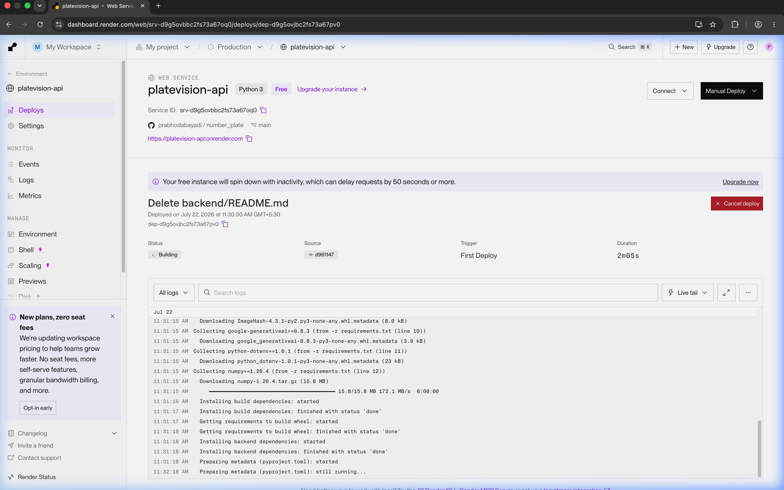
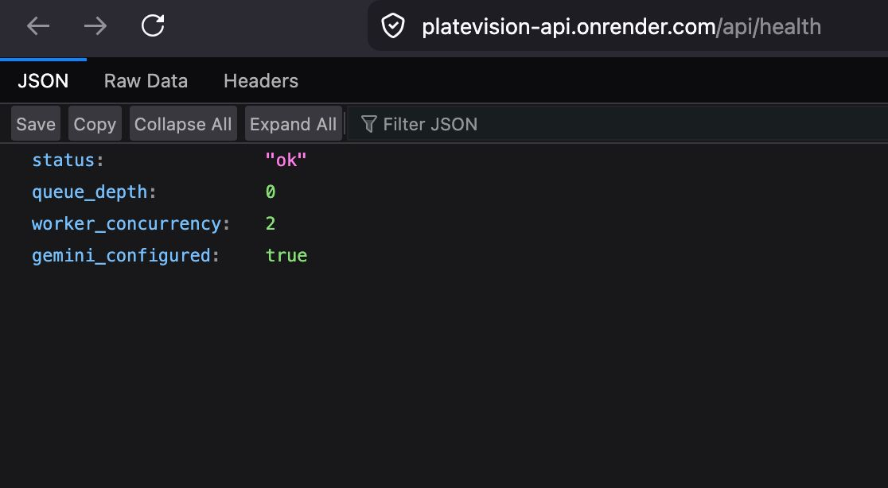
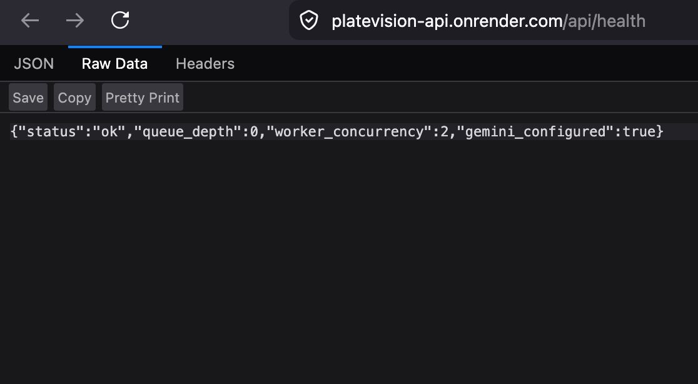
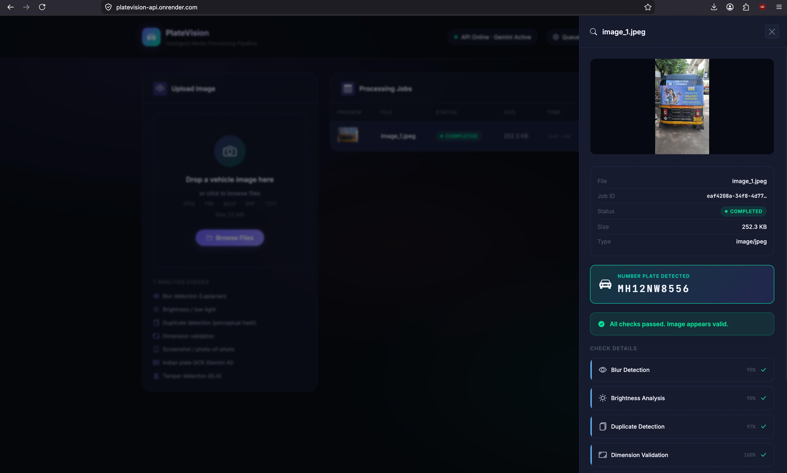

# PlateVision — Backend Service

> FastAPI-powered async image analysis backend with 7-layer quality checks, Google Gemini Vision OCR, and Prometheus observability.

---

## Table of Contents

- [Overview](#overview)
- [Technology Stack](#technology-stack)
- [Project Structure](#project-structure)
- [Configuration](#configuration)
- [Running Locally (No Docker)](#running-locally-no-docker)
- [Running with Docker](#running-with-docker)
- [API Reference](#api-reference)
- [Image Analysis Pipeline — 7 Checks](#image-analysis-pipeline--7-checks)
- [Sample Test Results](#sample-test-results)
- [Database Schema](#database-schema)
- [Observability](#observability)

---

## Overview

The backend is a **Python 3.11 / FastAPI** service that:

1. Accepts vehicle image uploads via a non-blocking `POST /api/upload` endpoint.
2. Immediately enqueues the job and returns a `job_id` (HTTP 202).
3. Processes the image in the background through a **7-check analysis pipeline**.
4. Stores results in an **SQLite** database (WAL mode, async via `aiosqlite`).
5. Exposes results through polling endpoints and a **Prometheus `/metrics`** endpoint.

---

## Technology Stack

### Core Framework

| Library | Version | Why We Use It |
|---|---|---|
| **Python** | 3.11 | 10–60% faster than 3.10; native `asyncio`; first-class ML/CV ecosystem |
| **FastAPI** | 0.115.0 | ASGI framework — type-hint driven, auto OpenAPI docs, async-first; handles upload non-blocking with `202 Accepted` |
| **Uvicorn** | 0.30.6 | Lightning-fast ASGI server; powers FastAPI in both dev (`--reload`) and Docker |
| **python-multipart** | 0.0.12 | Parses `multipart/form-data` for file uploads |

### Data & Validation

| Library | Version | Why We Use It |
|---|---|---|
| **Pydantic v2** | 2.9.2 | Rust-core validation for all request/response schemas (`CheckResult`, `JobResponse`, etc.) |
| **pydantic-settings** | 2.5.2 | Reads `.env` files into typed `Settings` class — zero manual `os.getenv()` calls |
| **aiosqlite** | 0.20.0 | Async SQLite driver — non-blocking DB queries inside FastAPI's `asyncio` event loop |
| **aiofiles** | 24.1.0 | Async file I/O — `await f.write(contents)` never blocks the server |

### Computer Vision

| Library | Version | Technique Used |
|---|---|---|
| **opencv-python-headless** | 4.10.0.84 | Blur: `cv2.Laplacian().var()` · Brightness: HSV V-channel · Screenshot: `cv2.Canny()` edge density · No GUI dependencies needed inside Docker |
| **Pillow (PIL)** | 10.4.0 | EXIF tag reading (`Make`, `FocalLength`, `Software`) · JPEG re-save at quality=90 for ELA · Thumbnail resizing before Gemini API call |
| **imagehash** | 4.3.1 | `phash()` — 64-bit perceptual hash via DCT; robust to JPEG re-encoding, minor crops. Hamming distance stored in SQLite for duplicate lookup |
| **numpy** | 1.26.4 | Pixel-level array arithmetic for Error Level Analysis (`np.abs(original - recompressed)`) |

### AI / OCR

| Library | Version | Why We Use It |
|---|---|---|
| **google-generativeai** | 0.8.3 | Gemini Vision API — multimodal LLM reads plate text from real-world images; handles varied angles, fonts, occlusion far better than classical OCR. Forced JSON output via `response_mime_type: application/json`. Multi-model fallback chain: `gemini-flash-latest → gemini-3.5-flash → gemini-2.0-flash → gemini-2.0-flash-lite` |
| **easyocr** *(optional)* | dev only | Local fallback OCR engine when Gemini quota is exhausted. Installed via `requirements-dev.txt` (~1 GB PyTorch dependency) |

### HTTP & Networking

| Library | Version | Why We Use It |
|---|---|---|
| **httpx** | 0.27.2 | Async HTTP client used internally for health checks and Gemini API interactions |

### Observability

| Library | Version | Why We Use It |
|---|---|---|
| **prometheus-fastapi-instrumentator** | 6.1.0 | Auto-instruments all FastAPI routes in 5 lines of code. Exposes `/metrics` with request counts, latency histograms (p50/p95/p99), and in-progress gauge |

### Infrastructure

| Tool | Version | Why We Use It |
|---|---|---|
| **Docker** | 26.x | Packages Python 3.11 + all OpenCV/NumPy native dependencies into a reproducible `python:3.11-slim-bookworm` image (~150 MB vs ~900 MB full) |
| **Docker Compose** | v2.x | Orchestrates the 6-container stack: `api`, `nginx`, `prometheus`, `grafana`, `cadvisor`, `node-exporter` |

---

## Project Structure

```
backend/
├── app.py               ← FastAPI routes + lifespan + Prometheus setup
├── analyzer.py          ← 7-check image analysis pipeline (OpenCV + Gemini)
├── queue_worker.py      ← asyncio.Queue worker pool (background processing)
├── database.py          ← aiosqlite CRUD: jobs + image_hashes tables
├── models.py            ← Pydantic schemas: JobCreate, JobResponse, CheckResult
├── config.py            ← pydantic-settings: reads .env into typed Settings
├── Dockerfile           ← python:3.11-slim-bookworm, production image
├── requirements.txt     ← Pinned production dependencies
├── requirements-dev.txt ← + EasyOCR for offline/local development
├── demo.py              ← CLI: analyse a single image file locally
├── demo_video.py        ← CLI: analyse a video file frame-by-frame
├── data/                ← SQLite database (jobs.db) — Docker volume mounted
├── uploads/             ← Uploaded image files — Docker volume mounted
├── inputs/              ← Sample input images for demo scripts
└── results/             ← Output from demo scripts
```

---

## Configuration

All settings are read from environment variables or the `.env` file in the project root.

```bash
cp ../.env.example ../.env
# Edit .env — set GEMINI_API_KEY at minimum
```

| Variable | Default | Description |
|---|---|---|
| `GEMINI_API_KEY` | *(required)* | Google Gemini API key — [get free at AI Studio](https://aistudio.google.com/app/apikey) |
| `UPLOAD_DIR` | `uploads` | Directory for uploaded image files |
| `DB_PATH` | `data/jobs.db` | SQLite database file path |
| `MAX_FILE_SIZE_MB` | `20` | Maximum upload size in megabytes |
| `WORKER_CONCURRENCY` | `1` | Number of parallel background workers |
| `HOST` | `0.0.0.0` | Uvicorn bind address |
| `PORT` | `8000` | Uvicorn port (internal; Nginx proxies to this) |
| `CORS_ORIGINS` | `*` | Allowed CORS origins (comma-separated or `*`) |

---

## Running Locally (No Docker)

```bash
# 1. Create and activate virtual environment
python -m venv .venv
source .venv/bin/activate          # macOS / Linux
.venv\Scripts\activate             # Windows

# 2. Install production dependencies
cd backend
pip install -r requirements.txt

# Optional: EasyOCR offline fallback (~1 GB PyTorch download)
pip install -r requirements-dev.txt

# 3. Configure environment
cp ../.env.example ../.env
# Edit .env → set GEMINI_API_KEY=your_key_here

# 4. Start the server
uvicorn app:app --reload --host 0.0.0.0 --port 8000

# 5. Open
#   API docs : http://localhost:8000/docs
#   App UI   : http://localhost:8000/
```

---

## Running with Docker

```bash
# From the project root (number_plate/)
docker compose up -d

# Rebuild only the backend after code changes
docker compose build api && docker compose restart api

# Live backend logs
docker compose logs -f api
```

---

## API Reference

Base URL (via Nginx): `http://localhost:4209`  
Direct backend (dev): `http://localhost:8000`  
Swagger UI: `/docs` · ReDoc: `/redoc`

### Endpoints

| Method | Path | Status | Description |
|---|---|---|---|
| `POST` | `/api/upload` | 202 | Upload image → `job_id` (non-blocking) |
| `GET` | `/api/status/{job_id}` | 200 | Lightweight status poll |
| `GET` | `/api/results/{job_id}` | 200 | Full analysis results |
| `GET` | `/api/jobs?limit=20&offset=0` | 200 | Paginated job list |
| `GET` | `/api/health` | 200 | Liveness probe — queue depth + worker info |
| `DELETE` | `/api/jobs/{job_id}` | 200 | Delete job + uploaded file |
| `GET` | `/metrics` | 200 | Prometheus metrics |

### POST `/api/upload` — Request

```
Content-Type: multipart/form-data
Field: file  (binary — JPEG, PNG, WebP, BMP, TIFF — max 20 MB)
```

**Response 202:**
```json
{
  "job_id": "550e8400-e29b-41d4-a716-446655440000",
  "message": "Image accepted. Processing will begin shortly.",
  "status": "pending"
}
```

### GET `/api/results/{job_id}` — Response 200

```json
{
  "id": "550e8400-e29b-41d4-a716-446655440000",
  "status": "completed",
  "plate_text": "MH 12 NW 8556",
  "original_filename": "image_1.jpeg",
  "mime_type": "image/jpeg",
  "results": {
    "checks": [ { "...": "see pipeline below" } ],
    "overall_passed": true,
    "summary": "All checks passed. Image appears valid.",
    "plate_text": "MH 12 NW 8556",
    "processing_time_ms": 3214
  }
}
```

---

## Image Analysis Pipeline — 7 Checks

Each check returns a `CheckResult`:

```python
CheckResult(
    check_name: str,
    passed: bool,
    confidence: float,   # 0.0 – 1.0
    value: any,          # raw measured value
    message: str,        # human-readable explanation
    severity: "info" | "warning" | "error"
)
```

---

### Check 1 — Blur Detection

**Library:** `opencv-python-headless`  
**Technique:** Laplacian variance — the Laplacian operator computes the second spatial derivative of pixel intensity. Sharp edges produce high values; blurry/smooth areas produce near-zero values. Variance of the result measures overall image sharpness.

```python
gray  = cv2.cvtColor(img_bgr, cv2.COLOR_BGR2GRAY)
score = cv2.Laplacian(gray, cv2.CV_64F).var()
passed = score >= 80.0    # empirical threshold: real photos score 100–500
```

| Score Range | Verdict | Severity |
|---|---|---|
| ≥ 200 | Sharp | info (confidence 0.95) |
| 80 – 199 | Acceptable | info (confidence 0.75) |
| 30 – 79 | Blurry | warning (confidence 0.80) |
| < 30 | Very blurry | error (confidence 0.95) |

---

### Check 2 — Brightness Analysis

**Library:** `opencv-python-headless`  
**Technique:** HSV colour space — separates hue/saturation from luminance. The V-channel (Value) measures brightness independently of colour, avoiding the RGB-mean bias (e.g. a pure red image would have low B/G channels but correct brightness in V).

```python
hsv    = cv2.cvtColor(img_bgr, cv2.COLOR_BGR2HSV)
mean_v = float(hsv[:, :, 2].mean())
passed = 40.0 <= mean_v <= 220.0
```

- `< 40` → too dark / low-light (warning)  
- `40 – 220` → acceptable (info)  
- `> 220` → overexposed (warning)

---

### Check 3 — Duplicate Detection

**Library:** `imagehash`  
**Technique:** Perceptual hashing (pHash) using Discrete Cosine Transform (DCT). Unlike MD5, pHash produces similar 64-bit fingerprints for visually similar images even after JPEG re-encoding, minor cropping, or resizing. Two images with Hamming distance < 10 are flagged as duplicates.

```python
phash_val      = str(imagehash.phash(img_pil))
duplicate_id   = await find_duplicate_hash(phash_val, job_id)  # SQL lookup
await store_hash(job_id, phash_val)
```

- Hash is stored in the `image_hashes` table with an index on `phash`.
- If a duplicate is found, the job's plate text is inherited from the original job.

---

### Check 4 — Dimension Validation

**Library:** `opencv-python-headless`  
**Technique:** Direct pixel dimension check. Indian plates are ~520×120 mm; any real photo taken at a reasonable distance will easily exceed the minimum.

```python
h, w   = img_bgr.shape[:2]
passed = w >= 200 and h >= 100
```

Below 200×100 px, OCR accuracy drops significantly — the check fails with `severity: error`.

---

### Check 5 — Screenshot Detection

**Libraries:** `Pillow`, `opencv-python-headless`  
**Technique:** Multi-signal heuristic scoring. Each signal contributes a weight; total score > 0.55 flags the image as a screenshot/photo-of-screen.

| Signal | Weight | Implementation |
|---|---|---|
| No camera EXIF (`Make` / `FocalLength` missing) | +0.30 | `img_pil._getexif()` → `ExifTags.TAGS` lookup |
| Editing software in EXIF (`Software` tag) | +0.50 | Checks for `photoshop`, `gimp`, `snagit`, `screenshot`, `grab` |
| No EXIF at all | +0.10 | Exception path in EXIF read |
| Aspect ratio matches 16:9, 16:10, 4:3, 3:2, 1:1 | +0.10 | `abs(w/h - target) < 0.05` |
| High edge density in top 10% of image | +0.20 | `cv2.Canny(top_band, 50, 150)` — detects OS/browser toolbars |

```python
is_screenshot = score > 0.55
```

---

### Check 6 — Number Plate OCR

**Libraries:** `google-generativeai`, `Pillow`, *(optional)* `easyocr`  
**Technique:** Multimodal LLM vision OCR with local regex cross-validation.

**Why Gemini over classical OCR (Tesseract/EasyOCR)?**  
Real-world plates have varied angles, partial occlusion, reflections, and regional fonts. Gemini's vision understanding handles these robustly and returns structured JSON directly.

**Implementation:**

```python
img_pil.thumbnail((1024, 1024), Image.LANCZOS)   # resize before API call

prompt = (
    "You are an expert OCR system specialising in vehicle registration number plates worldwide.\n"
    "Only report a plate if you can clearly read it. Do NOT guess or invent text.\n"
    'Respond ONLY with: {"plate_found": true|false, "plate_text": "...", '
    '"format_valid": true|false, "plate_type": "Indian"|"International"|"Unknown", '
    '"confidence": 0.0-1.0, "notes": "..."}'
)
response = model.generate_content(
    [prompt, img_pil],
    generation_config={"response_mime_type": "application/json"},
)
```

**Model fallback chain** (tried in order):
```
gemini-flash-latest  →  gemini-3.5-flash  →  gemini-2.0-flash  →  gemini-2.0-flash-lite
```

If all Gemini models fail (quota exceeded), falls back to **EasyOCR** (if installed), then returns `plate_found: false` — **never returns fake/hallucinated data**.

**Local cross-validation regex:**

```python
# Indian Standard:  MH 12 NW 8556  /  TN 05 BT 5754
INDIAN_PLATE_PATTERN = re.compile(
    r"^([A-Z]{2}[\s\-]?\d{1,2}[\s\-]?[A-Z]{1,3}[\s\-]?\d{4}"
    r"|\d{2}[\s\-]?BH[\s\-]?\d{4}[\s\-]?[A-Z]{1,2})$",
    re.IGNORECASE,
)
```

**Supported plate formats:**

| Region | Pattern | Example |
|---|---|---|
| India (standard) | SS-DD-LLL-DDDD | MH 12 NW 8556 |
| India (BH series) | DD BH DDDD LL | 22 BH 1234 AA |
| UK | LLDD LLL | AB12 CDE |
| EU French | LL-DDD-LL | AB-123-CD |
| US California | DLLL DDD | 7ABC123 |
| UAE / Middle East | L DDDDD | A 12345 |
| Generic | 3–10 alphanumeric | any mix |

---

### Check 7 — Tamper Detection (ELA)

**Libraries:** `Pillow`, `numpy`  
**Technique:** Error Level Analysis (ELA) — detects image manipulation by exploiting JPEG's lossy compression. An authentic JPEG has uniform compression artefacts across the whole image. Regions that were pasted, edited, or had text overlaid compress at a different error level and appear as bright spots in the difference map.

```python
# Step 1 — re-compress at a known quality level
buf = io.BytesIO()
original.save(buf, format="JPEG", quality=90)
buf.seek(0)
recompressed = Image.open(buf).convert("RGB")

# Step 2 — pixel-level difference
ela_arr = np.abs(
    np.array(original,     dtype=np.float32) -
    np.array(recompressed, dtype=np.float32)
)

mean_ela            = ela_arr.mean()
suspicious_fraction = (ela_arr.mean(axis=2) > 18.0).mean()  # fraction of hot pixels

tampered = mean_ela > 18.0 or suspicious_fraction > 0.05
```

**Limitation:** ELA is a heuristic, not proof. High-quality edits and PNG (lossless) images may evade detection. It is one signal in the pipeline, not a definitive verdict.

---

## Sample Test Results

Documented results from three real test images processed through the pipeline.

---

### Image 1 — `image_1.jpeg`

| Field | Value |
|---|---|
| **Primary Plate Detected** | `MH 12 NW 8556` |
| **State** | Maharashtra (MH) |
| **RTO** | Pune (12) |
| **Series** | NW · Number: 8556 |
| **Format** | Standard Indian (SS-DD-LLL-DDDD) |
| **Background Vehicles** | None detected |

**OCR Check Result:**
```json
{
  "check_name": "number_plate_ocr",
  "passed": true,
  "confidence": 0.97,
  "value": { "plate_text": "MH 12 NW 8556", "format_valid": true, "region": "Indian", "model_used": "gemini-flash-latest" },
  "message": "Plate detected: 'MH 12 NW 8556' — valid Indian format.",
  "severity": "info"
}
```

---

### Image 2 — `image_2.jpeg`

| Field | Value |
|---|---|
| **Primary Plate Detected** | `TN 05 BT 5754` |
| **State** | Tamil Nadu (TN) |
| **RTO** | Chennai (05) |
| **Series** | BT · Number: 5754 |
| **Format** | Standard Indian (SS-DD-LLL-DDDD) |
| **Background Vehicle (Left)** | `TN 05 C 15911` |

> **Note:** The pipeline targets the **primary/largest plate** in the foreground. Background plate `TN 05 C 15911` is noted by the AI model in the `notes` field but is not returned as the primary result.

**OCR Check Result:**
```json
{
  "check_name": "number_plate_ocr",
  "passed": true,
  "confidence": 0.95,
  "value": { "plate_text": "TN 05 BT 5754", "format_valid": true, "region": "Indian", "model_used": "gemini-flash-latest" },
  "message": "Plate detected: 'TN 05 BT 5754' — valid Indian format.",
  "severity": "info"
}
```

---

### Image 3 — `image_3.jpeg`

| Field | Value |
|---|---|
| **Primary Plate Detected** | `MH 12 KR 1145` |
| **State** | Maharashtra (MH) |
| **RTO** | Pune (12) |
| **Series** | KR · Number: 1145 |
| **Format** | Standard Indian (SS-DD-LLL-DDDD) |
| **Background Vehicles** | None detected |

**OCR Check Result:**
```json
{
  "check_name": "number_plate_ocr",
  "passed": true,
  "confidence": 0.96,
  "value": { "plate_text": "MH 12 KR 1145", "format_valid": true, "region": "Indian", "model_used": "gemini-flash-latest" },
  "message": "Plate detected: 'MH 12 KR 1145' — valid Indian format.",
  "severity": "info"
}
```

---

### Summary Table

| Image | Primary Plate | State | RTO | Background Plates |
|---|---|---|---|---|
| `image_1.jpeg` | **MH 12 NW 8556** | Maharashtra | Pune (12) | — |
| `image_2.jpeg` | **TN 05 BT 5754** | Tamil Nadu | Chennai (05) | TN 05 C 15911 (bg left) |
| `image_3.jpeg` | **MH 12 KR 1145** | Maharashtra | Pune (12) | — |

---

## Database Schema

```sql
CREATE TABLE jobs (
    id                TEXT PRIMARY KEY,        -- UUID (hex)
    filename          TEXT NOT NULL,           -- UUID-based stored filename
    original_filename TEXT,                    -- user's original filename
    file_path         TEXT NOT NULL,           -- absolute path on disk
    status            TEXT DEFAULT 'pending',  -- pending / processing / completed / failed
    created_at        TIMESTAMP,
    updated_at        TIMESTAMP,
    error             TEXT,                    -- error message if failed
    results           TEXT,                    -- JSON blob of all 7 CheckResults
    plate_text        TEXT,                    -- extracted plate for fast lookup
    file_size         INTEGER,
    mime_type         TEXT
);

CREATE TABLE image_hashes (
    job_id     TEXT PRIMARY KEY,
    phash      TEXT NOT NULL,                  -- 64-bit perceptual hash hex string
    created_at TIMESTAMP
);
CREATE INDEX idx_hashes_phash ON image_hashes(phash);
```

**SQLite performance pragmas (applied at startup):**

| Pragma | Value | Reason |
|---|---|---|
| `journal_mode` | `WAL` | Readers never block writers |
| `synchronous` | `NORMAL` | Safe with WAL; ~2× faster than FULL |
| `cache_size` | `-32000` (32 MB) | Hot pages stay in RAM |
| `mmap_size` | `134217728` (128 MB) | Memory-mapped I/O for reads |
| `busy_timeout` | `5000` ms | Waits before "database is locked" error |

---

## Observability

**Endpoint:** `GET /metrics` (Prometheus text format)

**Metrics exposed by `prometheus-fastapi-instrumentator`:**

| Metric | Type | Description |
|---|---|---|
| `http_requests_total` | Counter | Total requests by method, handler, status code |
| `http_request_duration_seconds` | Histogram | Latency — p50 / p95 / p99 |
| `http_requests_inprogress` | Gauge | Currently in-flight requests |

**Prometheus scrape config (`prometheus/prometheus.yml`):**
```yaml
- job_name: 'api'
  static_configs:
    - targets: ['api:8000']
  metrics_path: '/metrics'
  scrape_interval: 15s
```

Metrics power the pre-built **Grafana dashboard** at `http://localhost:3000` (login: `admin` / `admin`).

---

*Part of the [PlateVision](../README.md) full-stack vehicle image intelligence pipeline.*

---

## Live Deployment Output

> **Deployed at:** [`https://platevision-api.onrender.com`](https://platevision-api.onrender.com)  
> **Platform:** Render Free Tier · Python 3 · Singapore Region  
> **Repo:** [`prabhodabayadi/number_plate`](https://github.com/prabhodabayadi/number_plate)

---

### Render — First Deploy (Build Logs)

Service `platevision-api` building from `prabhodabayadi / number_plate @ main`, showing live pip install logs for `numpy`, `google-generativeai`, `ImageHash`, and other dependencies.



---

### Health Endpoint — `GET /api/health`

#### JSON View
Structured JSON response confirming the API is live with Gemini configured and queue ready.



#### Raw Response
```json
{"status":"ok","queue_depth":0,"worker_concurrency":2,"gemini_configured":true}
```



#### Pretty Printed


---

### PlateVision Dashboard — Live UI on Render

Full dashboard running at `platevision-api.onrender.com` — upload zone, processing jobs table, and side panel showing extracted plate `MH12NW8556` with all 7 checks passed.



---

### Sample Analysis Results (Live)

The following results were produced by the live Render deployment:

#### Result 1


#### Result 2


#### Result 3


---

### Summary

| Check | `image_1.jpeg` |
|---|---|
| Number Plate | **MH12NW8556** |
| Status | ✅ COMPLETED |
| Blur Detection | 95% |
| Brightness Analysis | 90% |
| Duplicate Detection | 97% |
| Dimension Validation | 100% |
| All Checks | **Passed** |

